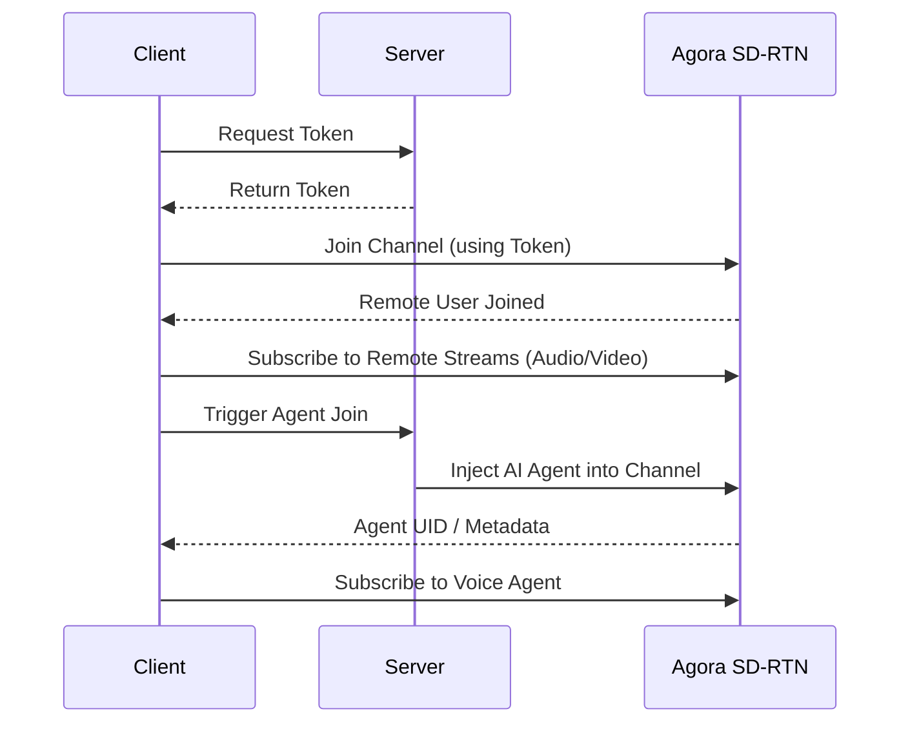

# Callmate

Callmate is a Voice AI application built using Agora's - Conversational AI Engine, this app enables user to enagage in a live chat with a voice agent

The system uses a cascading pipeline:
speech-to-text → LLM → text-to-speech, delivering fast and context-aware responses to user queries.

# Client Server Architecture


## Packages in this project

- `agora-rtc-react` handles room join, publish, local tracks, remote users, and remote audio hooks
- `agora-rtc-sdk-ng` creates the RTC client used by the provider
- `agora-token` builds the RTC token on the server
- The room page calls `/api/agora/token` first, then joins the channel
- After join, the room page calls `/api/agora/agentai` to connect the AI agent

## Getting started

1. Install dependencies:

```bash
npm install
```

2. Create a `.env` file in the project root:

```env
NEXT_PUBLIC_AGORA_APP_ID=
AGORA_APP_ID=
AGORA_APP_CERTIFICATE=
AGORA_CUSTOMER_ID=
AGORA_CUSTOMER_SECRET=
```

3. Fill the Agora values:

Agora Console: https://console.agora.io

- `NEXT_PUBLIC_AGORA_APP_ID`: your Agora project App ID from Agora Console
- `AGORA_APP_ID`: same Agora App ID, used on the server
- `AGORA_APP_CERTIFICATE`: from Agora Console under Project Management for your project. The Agora references note this under project settings and App Certificate setup.
- `AGORA_CUSTOMER_ID`: from Agora Console under `Developer Toolkit -> RESTful API`
- `AGORA_CUSTOMER_SECRET`: from Agora Console under `Developer Toolkit -> RESTful API`

4. Start the development server:

```bash
npm run dev
```

5. Build the project:

```bash
npm run build
```

6. Open `http://localhost:3000`

## What is in the project

- `app/room/[roomId]/page.tsx`: live room with local video, remote users, and push-to-talk for AI
- `app/api/agora/token/route.ts`: creates an Agora token for a room
- `app/api/agora/agentai/route.ts`: asks Agora to join an AI agent to the room
- `lib/createtoken.ts`: server token helper


## Flow

1. User creates a new room or enters an existing room ID.
2. User opens `/room/[roomId]`.
3. The room page fetches an Agora token and joins the room.
4. Camera and mic tracks are created and published.
5. The app requests the AI agent to join the same Agora room.
6. The user holds the button to speak to the AI.
